# Guidance for Multi-Modal Video Analytics of Smart Product Value-added Subscription Services on AWS


## Table of Content

List the top-level sections of the README template, along with a hyperlink to the specific section.

1. [Overview](#overview-required)
    - [Cost](#cost)
2. [Prerequisites](#prerequisites-required)
3. [Deployment Steps](#deployment-steps-required)
4. [Deployment Validation](#deployment-validation-required)
5. [Running the Guidance](#running-the-guidance-required)
6. [Next Steps](#next-steps-required)
7. [Cleanup](#cleanup-required)

8. [FAQ](#faq-known-issues-additional-considerations-and-limitations-optional)

## Overview

### **Background**  
The rapid advancement of AI technology has revolutionized video analysis, especially in smart cameras, devices and smart homes industry, moving away from traditional models that depend on extensive datasets and manual feature extraction. These older methods suffer from limited generalization, inability to handle multimodal data, and poor contextual understanding. In contrast, large multimodal models like Claude 3 overcome these limitations with automatic feature learning, strong generalization across diverse data, integrated processing of visual, audio, and text information, and robust contextual modeling. This allows for rapid validation and reduced development costs in specific business scenarios, bypassing the cumbersome steps of traditional models.
### - **What problem does this Guidance solve?** 
#### Video Analysis

When providing end users with basic camera functions while offering advanced video analysis, scene understanding, and event judgment capabilities. Traditionally, video analysis relied on computer vision algorithms and machine learning models that required training datasets or handcrafted feature extractors and classifiers. However, this approach had inherent limitations:

1. Dependence on training data. Traditional machine learning models needed substantial data to learn specific classifications or object locations, making the curation of sufficient training datasets time-intensive, and in some cases, difficult to obtain.
2. Laborious feature engineering requiring domain expertise. These models necessitated manually designing and extracting video features like color, texture, and shape - a complex and time-consuming process demanding extensive domain knowledge.
3. Limited generalization. Traditional models could typically only handle specific video data types, with performance degrading significantly when encountering new scenarios or data distributions.
4. Lack of contextual understanding. These models could not effectively capture contextual cues like object relationships and action semantics, which are crucial for accurate video comprehension.

#### Messages Push

After video analysis, it is often necessary to make judgments based on the results. When user-defined conditions are met, various types of notification messages need to be pushed. For instance, an end-user may request: "Send a text message to my phone when a fox is detected in my yard," or "Immediately notify the home alarm system if an intruder breaks into my house."
In such scenarios, intelligent camera manufacturers face the following challenges:

1. Evaluating video analysis results for real-time or scheduled alert triggering.
2. Accommodating personalized alert conditions for each end-user, making it difficult to meet diverse needs.
3. Implementing various post-alert message processing workflows, requiring significant research and development resources.

#### Visual Summary and Question&Answer

After analyzing and storing video data, the end user expects to retrieve, query, ask questions, and summarize specific events of interest efficiently. For instance, when continuously monitoring pets at home with video surveillance, the user should be able to quickly find relevant video clips through retrospective queries, replay, view, and summarize interesting details during a specific time period. However, traditional methods lack this capability.

#### Image Search
The video data and frames are stored in a vector database, enabling users to quickly locate specific images and corresponding video clips through natural language queries. For example, users can search by entering phrases like "My dog and I playing on the grass."


### - **Architecture Diagram**
  


1. The user ingests data, edits prompt, performs analytics and sets postprocessing actions on website which is hosted on AWS Amplify.
2. The website passes the request to Amazon API Gateway as well as receives the response from API Gateway.
3. API Gateway directs a request to the video streaming and upload component, which integrates video data from a Smart Camera via Amazon Kinesis Video Streams or AWS IoT Core. AWS IoT Greengrass. AWS IoT Greengrass is used to manage and deploy machine learning models to edge devices.
4. API Gateway forwards the analysis request, which includes video frames and prompt, to the visual analytics component. This component, equipped with an AWS Lambda function and model library, processes the request and returns the result from the language model to API Gateway.
5. If the user set a postprocess action via input natural language, LLM Agent will perform it through serval AWS Lambda functions such as sending SMS to mobile client or notifications to edge devices.
6. The user can store the videos on Amazon Simple Storage Service (Amazon S3) and fine-tune prompts on Amazon DynamoDB.
7. The user have the option to save intermediate results of video analysis to Amazon OpenSearch through AWS Lambda function. Then, on the website, they can utilize LLM to conduct question-and-answer sessions based on the video content.

### Cost

### Sample Cost Table

The following table provides a sample cost breakdown for deploying this Guidance with the default parameters in the US East (N. Virginia) Region for one month(On-Demand).

| AWS service  | Dimensions [Token Number] | Input Token Cost [USD] |Output Token Cost [USD] |
| ----------- | ------------ | ------------ |------------ |
| Amazon Bedrock Claude3 Haiku | 1 Million  | $ 0.25 |$ 1.25 |
| Amazon Bedrock Claude3.5 Sonnet-v2 | 1 Millon | $ 3.00 |$ 15.00 |

| AWS service  | Spacification | Pricing|
| ----------- | ------------ | ------------ |
| Amazon OpenSearch Service | 	1 domain  m5.large.search, per month | $ 103.66 |
| Amazon DynamoDB |  100000 write, 1000 read , per month| $ 2.6 |

## Prerequisites 

### AWS account requirements
**resources:**
- Bedrock and Claude3 model access
- S3 bucket
- API Gateway 80/443 port access
- OpenSearch
- Lambda


### Supported Regions

- us-east-1
- us-west-2


## Deployment Prerequisite

1. AWS credential is ready such as aws configure or environment, prefer administrator permission and us-east-1 or us-west-2 region. reference https://docs.aws.amazon.com/cli/latest/userguide/cli-configure-envvars.html

2. AWS CDK v2 for python is ready, reference https://docs.aws.amazon.com/zh_cn/cdk/v2/guide/getting_started.html

3. Python boto3 is ready, reference https://boto3.amazonaws.com/v1/documentation/api/latest/guide/quickstart.html#installation
4. Ensure bedrock Anthropic Claude models permission. Model recommendation: Claude3.5 sonnet and Claude3 haiku for video analysis/postprocess, titan-multimodal-embedding-v1 for embedding. Be care that Claude3 sonnet is not appropriate for postprocess jobs  


## CDK Content
This CDK code contains 4 stacks and deploys a multi-modal video analysis system, including S3 buckets, DynamoDB tables, Opensearch, Lambda functions, an API Gateway WebSocket API, Cognito authentication, and a frontend web application.

1. MultiModalVideoAnalyticsStorageStack:

    S3 Buckets:

    * web-app-bucket: used to deploy the frontend web application

    * video-upload-bucket: used to upload video files

    * video-information-bucket: used to store video analysis results  
    
    Opensearch Domain:
    * Opensearch: used to retrieve frame  
    
    DynamoDB Tables:
    * DynamoDBPromptSample: used to store conversation prompts
    * DynamoDBConnectionID: used to store WebSocket connection IDs
    * DynamoDBChatHistory: used to store chat history
    * DynamoDBResult: used to store video analysis results
2. MultiModalVideoAnalyticsLambdaStack:

    Lambda Layers:
    * boto3: for the Python boto3 library
    * ffmpeg: for video processing
    * opensearch: for opensearch-client
    * rerank: for reranking recall results
    
    Lambda Functions:
    * websocket_notify: used to notify WebSocket clients
    * websocket_connect: used to handle WebSocket connections
    * websocket_disconnect: used to handle WebSocket disconnections
    * websocket_default: used to handle the default WebSocket route
    * get_kvs_streaming_url: used to get the Kinesis Video Streams stream URL
    * get_s3_presigned_url: used to get the S3 pre-signed URL
    * get_s3_video_url: used to get the S3 video file URL
    * list_s3_videos: used to list the video files in the S3 bucket
    * video_summary: used to generate video summaries
    * video_analysis: used to perform video analysis
    * frame_extraction: used to extract frames from videos
    * configure_video_resource: used to configure video resources
    * prompt_management_ws: used to manage conversation prompts
    * vqa_chatbot: used to handle the visual question-answering chatbot
    * agent_tool_send_device_mqtt: used to send device MQTT messages
    * agent_tool_send_notification: used to send notifications
    * opensearch_ingest: used to multi-modal embedding
    * opensearch_retrieve: used to frame retrieve from opensearch
3. MultiModalVideoAnalyticsAPIStack:

    API Gateway
    
    Adds the following WebSocket routes:
    * $connect: used to handle WebSocket connections
    * $disconnect: used to handle WebSocket disconnections
    * $default: used to handle the default WebSocket route
    * configure_agent: used to configure the agent
    * configure_video_resource: used to configure video resources
    * get_kvs_streaming_url: used to get the Kinesis Video Streams stream URL
    * get_s3_presigned_url: used to get the S3 pre-signed URL
    * get_s3_video_url: used to get the S3 video file URL
    * list_prompt: used to list the conversation prompts
    * list_s3_videos: used to list the video files in the S3 bucket
    * vqa_chatbot: used to handle the visual question-answering chatbot
    * opensearch_retrieve: used to frame retrieve from opensearch
4. MultiModalVideoAnalyticsWebAppStack:

    * cognito user pool
    * frontend web application via S3 bucket + cloudfront  

## Deployment Steps
Your deployment ec2/device should have a IAM role to access related AWS Resource.

You also can referce the workdshop below:  
[Workshop for Multi Modal Video Analytics on AWS](https://catalog.us-east-1.prod.workshops.aws/workshops/dd21f3c4-859f-4d4e-aed8-a7796aa4b2e7/zh-CN)

## Quick Start: Deployment use CDK

### Environment Setup(Optional)
As an example, the solution uses EC2 in us-west-2 region for the build process.

Log in to the AWS console, go to the EC2 service, and select "Launch new instance".

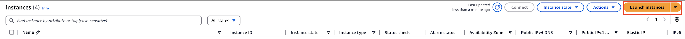

Set the EC2 Name to "MultiModalVideoAnalysticDeploy", select the instance image as "Amazon Linux 2023", type as "t3.large", storage 20GB, IAM with an Administrator EC2 permission. Keep the rest of the configuration as default, and click "Create". Wait for the creation to complete.

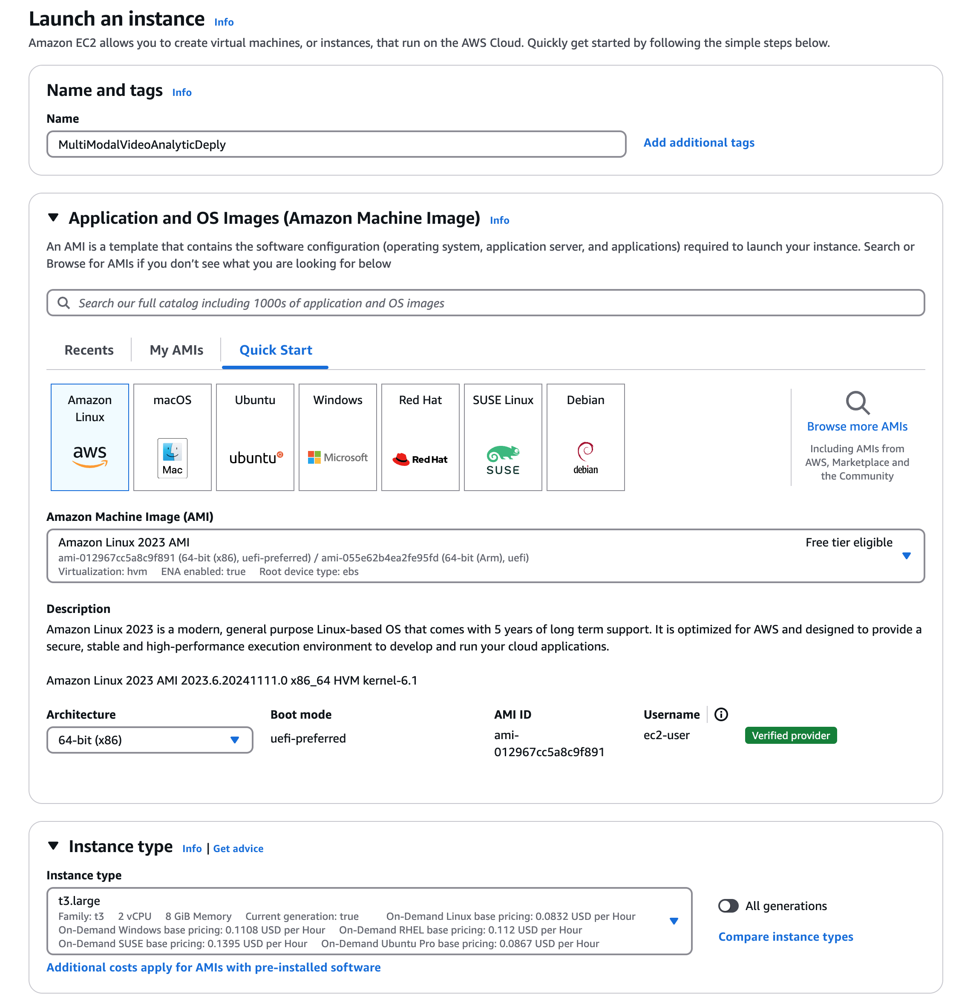
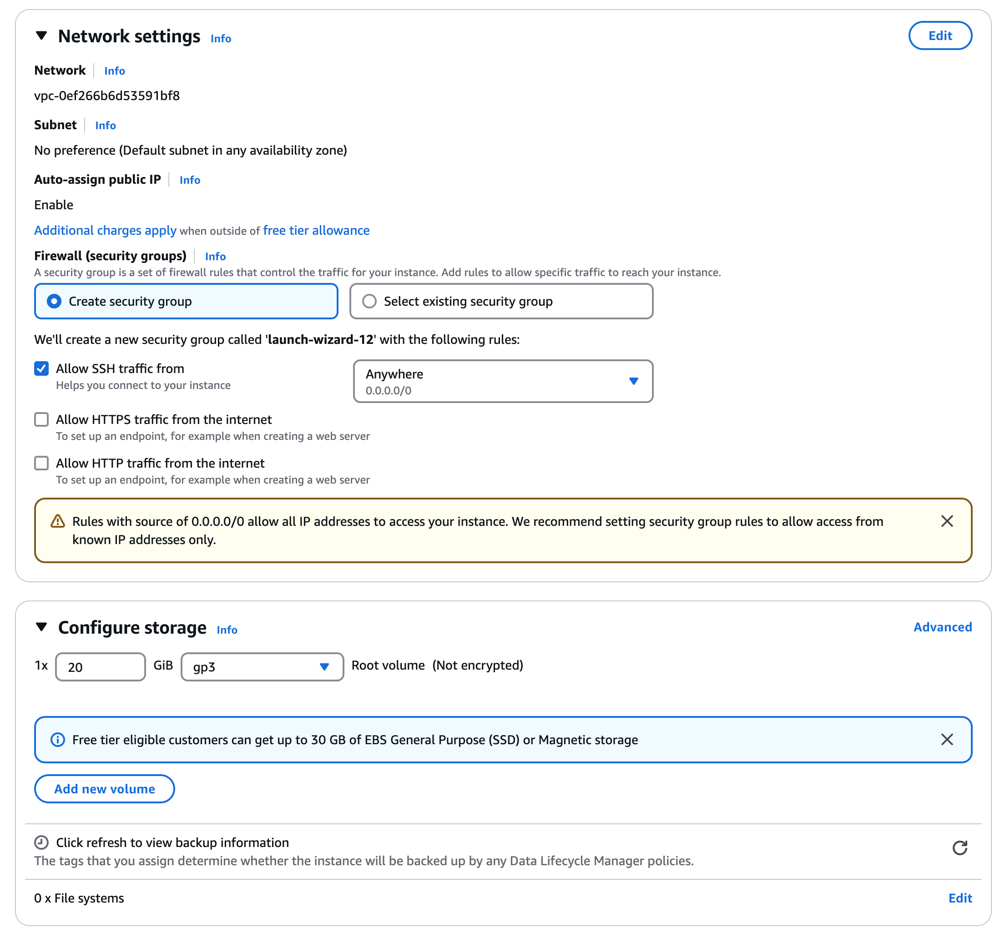
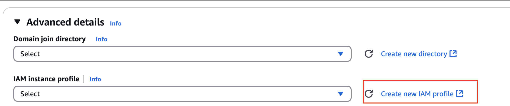
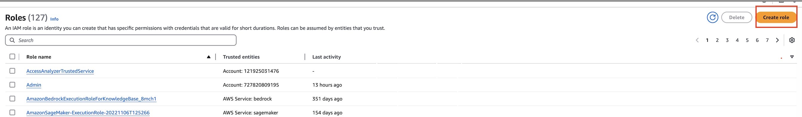
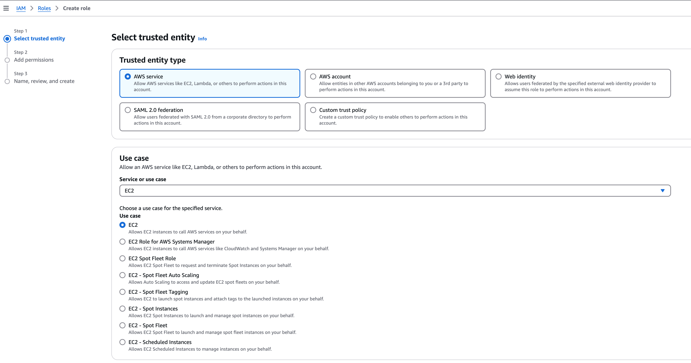
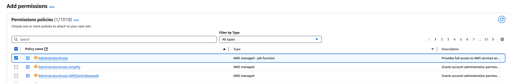
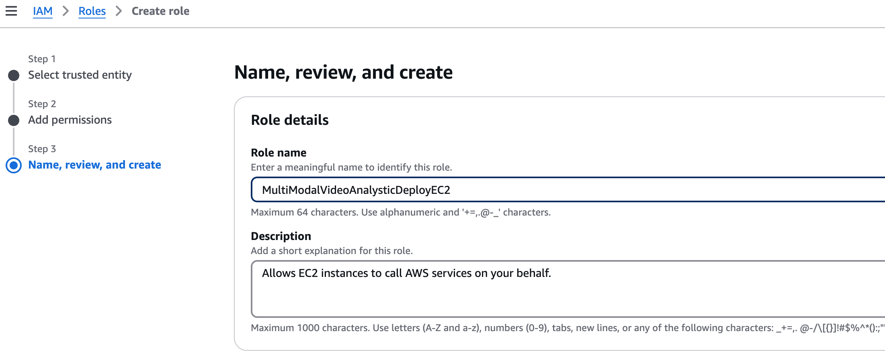
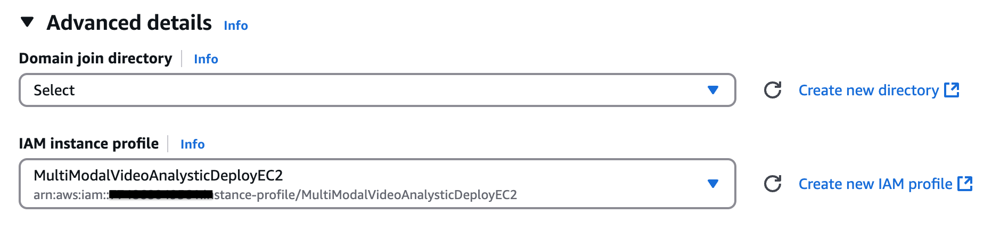

Login in the EC2

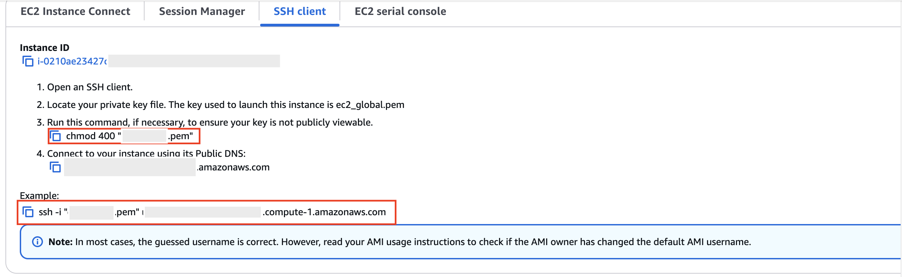
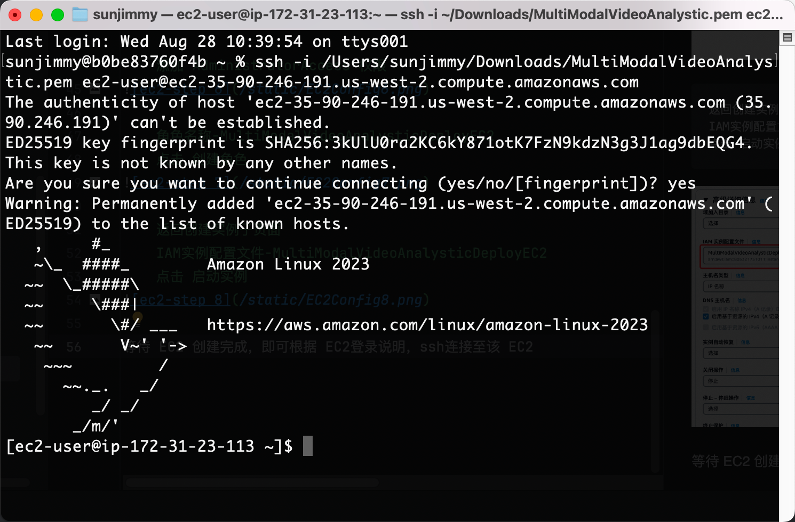

#### Get project repo
```bash
$ git clone https://github.com/aws-solutions-library-samples/guidance-for-multi-modal-video-analytics-of-smart-product-value-added-subscription-services-on-aws.git
```

You also can download the code package adn upload(optional)
```
scp -i <path to your-ec2.pem>  <path to guidance-for-multi-modal-video-analytics-main.tar.gz> ec2-user@ec2-xxx-xxx-xxx-xxx.us-west-2.compute.amazonaws.com:/home/ec2-user
```
For example, `scp -i /Users/sunjimmy/Downloads/MultiModalVideoAnalystic.pem  /Users/sunjimmy/Downloads/guidance-for-multi-modal-video-analytics-main.tar.gz ec2-user@ec2-xx-xx-xx-xxx.us-west-2.compute.amazonaws.com:/home/ec2-user`

Unzip the code
```
tar -xvf guidance-for-multi-modal-video-analytics.tar.gz
```

#### Build cdk and boto3 environment
```bash
sudo yum install python3-pip -y && \
sudo curl -sL https://rpm.nodesource.com/setup_18.x | sudo bash - && \
sudo yum install -y nodejs && \
sudo pip install aws-cdk.core && \
sudo pip install aws-cdk-lib constructs && \
sudo pip install --upgrade constructs && \
sudo pip install cdk-ecr-deployment && \
sudo python3 -m pip install --upgrade aws-cdk-lib && \
sudo npm install -g aws-cdk && \
pip install opensearch-py && \
sudo pip install boto3 && \
sudo yum install -y docker && \
sudo systemctl start docker
```
#### Deployment
```bash
cd guidance-for-multi-modal-video-analytics/deployment/cdk
sudo cdk bootstrap
sudo cdk deploy --all --require-approval never #if need ecs for long video analysis, add -c create_ecs_stack=true
```
the duration time is about 40 minutes.
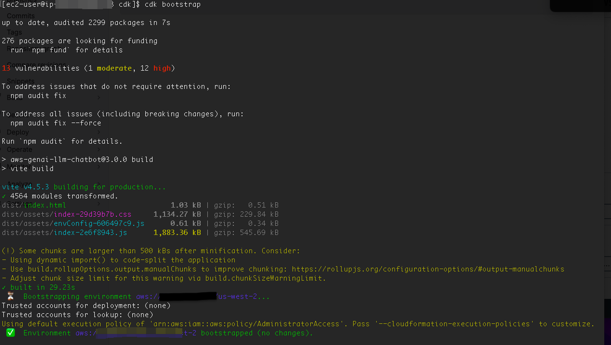
After cdk deploy is over, you will get many output parameters in console, record webappcloudfront.

Additional configuration
```
export AWS_DEFAULT_REGION=us-west-2   # or change to your actual region
python3 add_deployment.py 
```
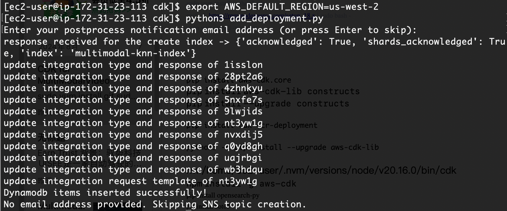


## Deployment Validation

* Open CloudFormation console and verify the status of the template, find a address like xxxxxxxxx.cloudfront.net.


## Running the Guidance

Go to login in the website
Enter the url webappcloudfront from browser, create an account, then you have completed the deployment
Video stream sample
If you want to test video stream as input resource, please check kvs_configuration_tutorial as a reference  


## Cleanup
```bash
$ sudo cdk destroy --all
```


## FAQ

* Question 1:  Can this guidance accept/process image input?   
Answer: No, this guidance currently only processes videos from S3 and video streams from KVS.

* Question 2: Can I perform video analysis through the API?  
Answer: Yes, you can use api Gateway URL to invoke.
