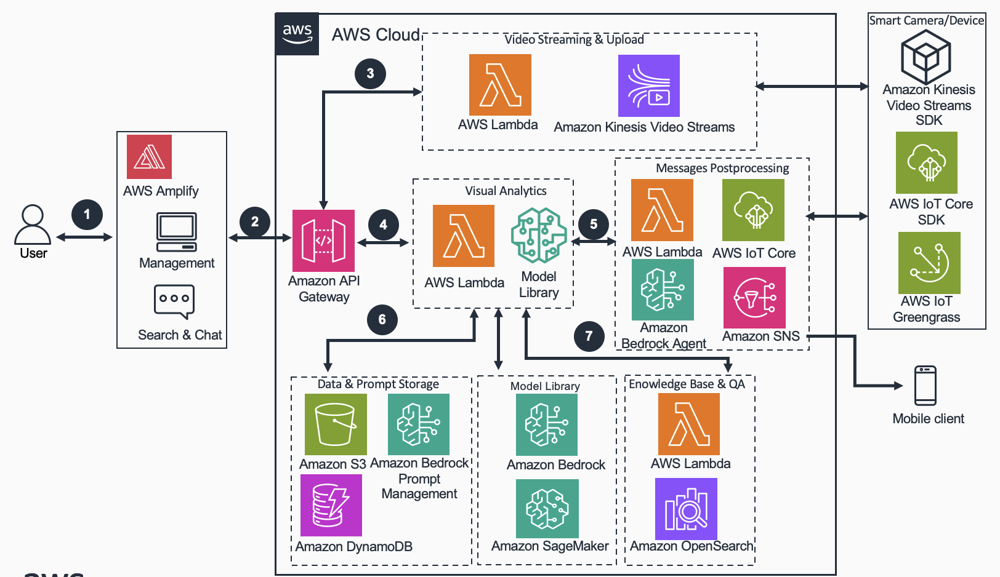

# Guidance for Multi-Modal Video Analytics of Smart Product Value-added Subscription Services on AWS


## Table of Content

List the top-level sections of the README template, along with a hyperlink to the specific section.

### Required

1. [Overview](#overview-required)
    - [Cost](#cost)
2. [Prerequisites](#prerequisites-required)
    - [Operating System](#operating-system-required)
3. [Deployment Steps](#deployment-steps-required)
4. [Deployment Validation](#deployment-validation-required)
5. [Running the Guidance](#running-the-guidance-required)
6. [Next Steps](#next-steps-required)
7. [Cleanup](#cleanup-required)

***Optional***

8. [FAQ, known issues, additional considerations, and limitations](#faq-known-issues-additional-considerations-and-limitations-optional)

## Overview (required)

### **Background**  
The rapid advancement of AI technology has revolutionized video analysis, especially in smart cameras, devices and smart homes industry, moving away from traditional models that depend on extensive datasets and manual feature extraction. These older methods suffer from limited generalization, inability to handle multimodal data, and poor contextual understanding. In contrast, large multimodal models like Claude 3 overcome these limitations with automatic feature learning, strong generalization across diverse data, integrated processing of visual, audio, and text information, and robust contextual modeling. This allows for rapid validation and reduced development costs in specific business scenarios, bypassing the cumbersome steps of traditional models.
### - **What problem does this Guidance solve?** 
#### Video Analysis

When providing end users with basic camera functions while offering advanced video analysis, scene understanding, and event judgment capabilities. Traditionally, video analysis relied on computer vision algorithms and machine learning models that required training datasets or handcrafted feature extractors and classifiers. However, this approach had inherent limitations:

1. Dependence on training data. Traditional machine learning models needed substantial data to learn specific classifications or object locations, making the curation of sufficient training datasets time-intensive, and in some cases, difficult to obtain.
2. Laborious feature engineering requiring domain expertise. These models necessitated manually designing and extracting video features like color, texture, and shape - a complex and time-consuming process demanding extensive domain knowledge.
3. Limited generalization. Traditional models could typically only handle specific video data types, with performance degrading significantly when encountering new scenarios or data distributions.
4. Lack of contextual understanding. These models could not effectively capture contextual cues like object relationships and action semantics, which are crucial for accurate video comprehension.

#### Messages Push

After video analysis, it is often necessary to make judgments based on the results. When user-defined conditions are met, various types of notification messages need to be pushed. For instance, an end-user may request: "Send a text message to my phone when a fox is detected in my yard," or "Immediately notify the home alarm system if an intruder breaks into my house."
In such scenarios, intelligent camera manufacturers face the following challenges:

1. Evaluating video analysis results for real-time or scheduled alert triggering.
2. Accommodating personalized alert conditions for each end-user, making it difficult to meet diverse needs.
3. Implementing various post-alert message processing workflows, requiring significant research and development resources.

#### Visual Summary and Question&Answer

After analyzing and storing video data, the end user expects to retrieve, query, ask questions, and summarize specific events of interest efficiently. For instance, when continuously monitoring pets at home with video surveillance, the user should be able to quickly find relevant video clips through retrospective queries, replay, view, and summarize interesting details during a specific time period. However, traditional methods lack this capability.

### - **Architecture Diagram**
  


1. The user ingests data, edits prompt, performs analytics and sets postprocessing actions on website which is hosted on AWS Amplify.
2. The website passes the request to Amazon API Gateway as well as receives the response from API Gateway.
3. API Gateway directs a request to the video streaming and upload component, which integrates video data from a Smart Camera via Amazon Kinesis Video Streams or AWS IoT Core. AWS IoT Greengrass. AWS IoT Greengrass is used to manage and deploy machine learning models to edge devices.
4. API Gateway forwards the analysis request, which includes video frames and prompt, to the visual analytics component. This component, equipped with an AWS Lambda function and model library, processes the request and returns the result from the language model to API Gateway.
5. If the user set a postprocess action via input natural language, LLM Agent will perform it through serval AWS Lambda functions such as sending SMS to mobile client or notifications to edge devices.
6. The user can store the videos on Amazon Simple Storage Service (Amazon S3) and fine-tune prompts on Amazon DynamoDB.
7. The user have the option to save intermediate results of video analysis to Amazon OpenSearch through AWS Lambda function. Then, on the website, they can utilize LLM to conduct question-and-answer sessions based on the video content.

### Cost

### Sample Cost Table

The following table provides a sample cost breakdown for deploying this Guidance with the default parameters in the US East (N. Virginia) Region for one month(On-Demand).

| AWS service  | Dimensions [Token Number] | Input Token Cost [USD] |Output Token Cost [USD] |
| ----------- | ------------ | ------------ |------------ |
| Amazon Bedrock Claude3 Haiku | 1 Million  | $ 0.25 |$ 1.25 |
| Amazon Bedrock Claude3 Haiku | 1 Millon | $ 3.00 |$ 15.00 |

## Prerequisites 

### AWS account requirements (If applicable)
**Example resources:**
- Bedrock and Claude3 model access
- S3 bucket
- API Gateway 80/443 port access


### aws cdk bootstrap (TODO)

<If using aws-cdk, include steps for account bootstrap for new cdk users.>

**Example blurb:** “This Guidance uses aws-cdk. If you are using aws-cdk for first time, please perform the below bootstrapping....”

### Service limits  (if applicable)

<Talk about any critical service limits that affect the regular functioning of the Guidance. If the Guidance requires service limit increase, include the service name, limit name and link to the service quotas page.>

### Supported Regions (if applicable)

<If the Guidance is built for specific AWS Regions, or if the services used in the Guidance do not support all Regions, please specify the Region this Guidance is best suited for>


## Deployment Steps (TODO)

Deployment steps must be numbered, comprehensive, and usable to customers at any level of AWS expertise. The steps must include the precise commands to run, and describe the action it performs.

* All steps must be numbered.
* If the step requires manual actions from the AWS console, include a screenshot if possible.
* The steps must start with the following command to clone the repo. ```git clone xxxxxxx```
* If applicable, provide instructions to create the Python virtual environment, and installing the packages using ```requirement.txt```.
* If applicable, provide instructions to capture the deployed resource ARN or ID using the CLI command (recommended), or console action.

 
**Example:**

1. Clone the repo using command ```git clone xxxxxxxxxx```
2. cd to the repo folder ```cd <repo-name>```
3. Install packages in requirements using command ```pip install requirement.txt```
4. Edit content of **file-name** and replace **s3-bucket** with the bucket name in your account.
5. Run this command to deploy the stack ```cdk deploy``` 
6. Capture the domain name created by running this CLI command ```aws apigateway ............```


## Deployment Validation  (TODO)

<Provide steps to validate a successful deployment, such as terminal output, verifying that the resource is created, status of the CloudFormation template, etc.>


**Examples:**

* Open CloudFormation console and verify the status of the template with the name starting with xxxxxx.
* If deployment is successful, you should see an active database instance with the name starting with <xxxxx> in        the RDS console.
*  Run the following CLI command to validate the deployment: ```aws cloudformation describe xxxxxxxxxxxxx```


## Running the Guidance (TODO)

<Provide instructions to run the Guidance with the sample data or input provided, and interpret the output received.> 

This section should include:

* Guidance inputs
* Commands to run
* Expected output (provide screenshot if possible)
* Output description


## Next Steps (TODO)

Provide suggestions and recommendations about how customers can modify the parameters and the components of the Guidance to further enhance it according to their requirements.


## Cleanup (TODO)

- Include detailed instructions, commands, and console actions to delete the deployed Guidance.
- If the Guidance requires manual deletion of resources, such as the content of an S3 bucket, please specify.


## FAQ, known issues, additional considerations, and limitations (TODO)


**Known issues (optional)**

<If there are common known issues, or errors that can occur during the Guidance deployment, describe the issue and resolution steps here>


**Additional considerations (if applicable)**

<Include considerations the customer must know while using the Guidance, such as anti-patterns, or billing considerations.>

**Examples:**

- “This Guidance creates a public AWS bucket required for the use-case.”
- “This Guidance created an Amazon SageMaker notebook that is billed per hour irrespective of usage.”
- “This Guidance creates unauthenticated public API endpoints.”


Provide a link to the *GitHub issues page* for users to provide feedback.


**Example:** *“For any feedback, questions, or suggestions, please use the issues tab under this repo.”*
